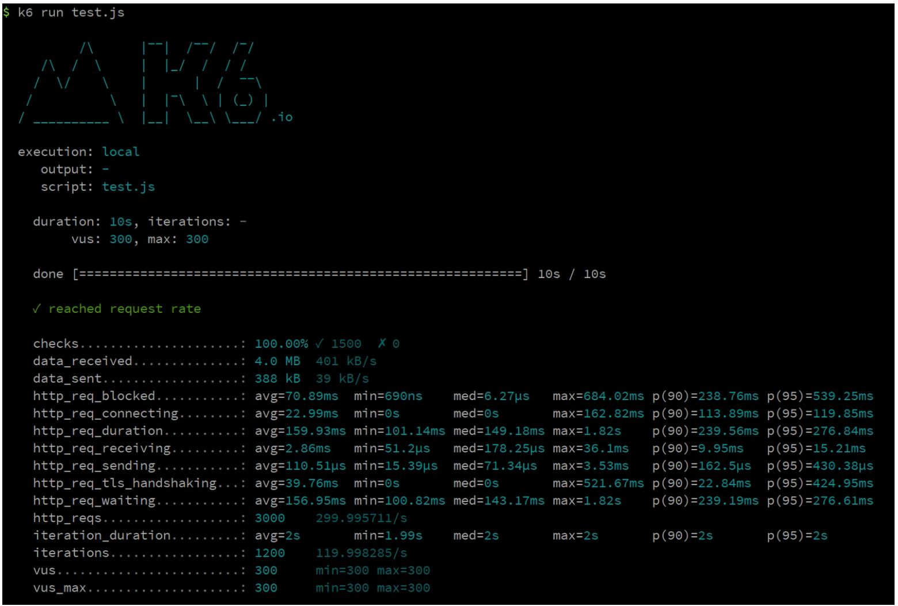
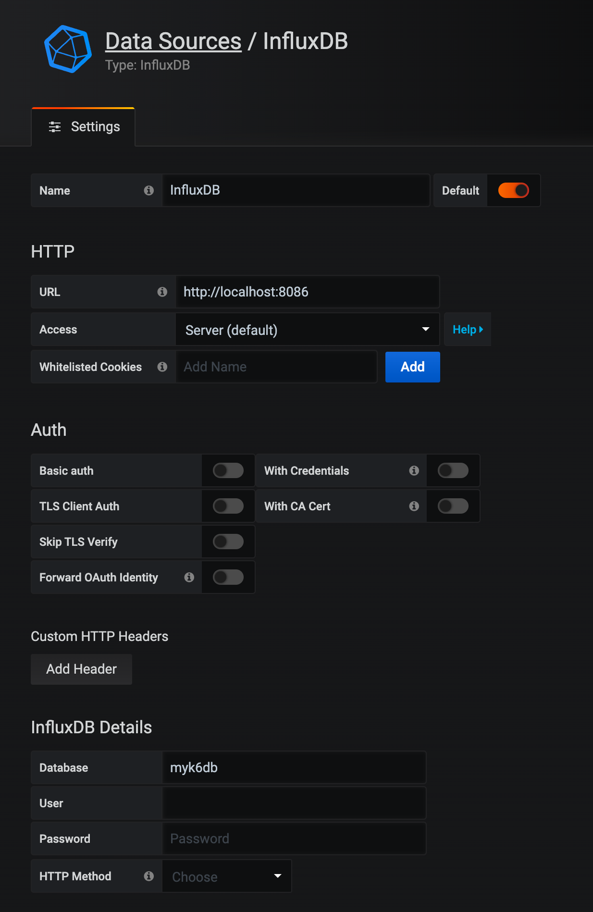
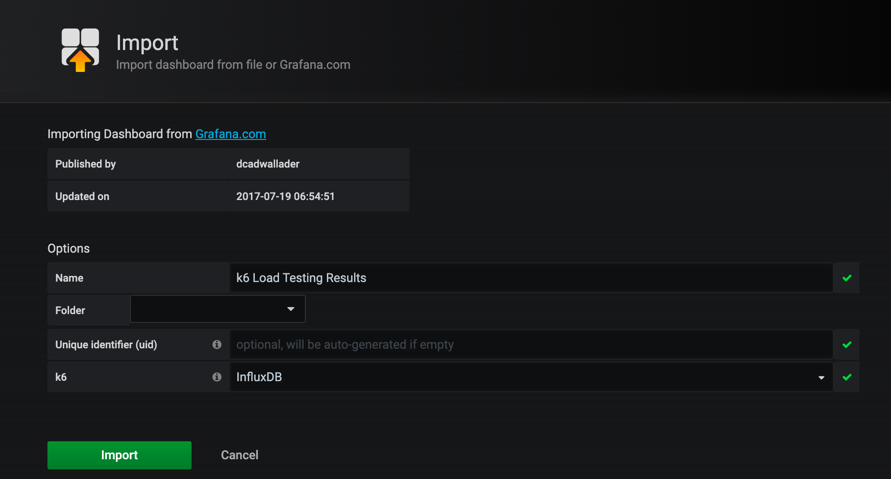
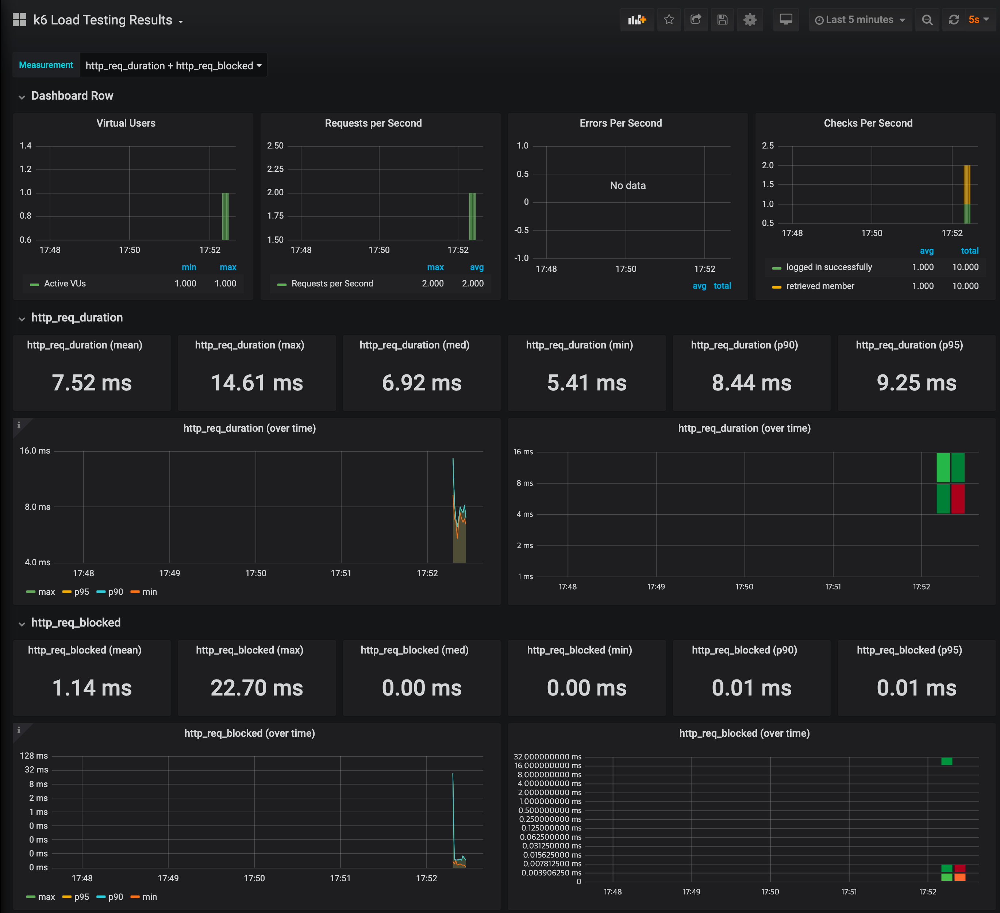

# 🚀 2단계 - 부하테스트
## 요구사항
- 부하 테스트
  - 테스트 전제조건 정리
    - 대상 시스템 범위
    - 목푯값 설정 (latency, throughput, 부하 유지기간)
    - 부하 테스트 시 저장될 데이터 건수 및 크기
  - 각 시나리오에 맞춰 스크립트 작성
    - 접속 빈도가 높은 페이지
    - 데이터를 갱신하는 페이지
    - 데이터를 조회하는데 여러 데이터를 참조하는 페이지
  - Smoke, Load, Stress 테스트 후 결과를 기록

### 부하테스트 소개
**k6 설치**
```shell
$ sudo apt-key adv --keyserver hkp://keyserver.ubuntu.com:80 --recv-keys C5AD17C747E3415A3642D57D77C6C491D6AC1D69
$ echo "deb https://dl.k6.io/deb stable main" | sudo tee /etc/apt/sources.list.d/k6.list
$ sudo apt-get update
$ sudo apt-get install k6
```

**Smoke Test**
```shell
$ k6 run stress.js
```
```shell
# stress.js
import http from 'k6/http';
import { check, group, sleep, fail } from 'k6';

export let options = {
  vus: 1, // 1 user looping for 1 minute
  duration: '10s',

  thresholds: {
    http_req_duration: ['p(99)<1500'], // 99% of requests must complete below 1.5s
  },
};

const BASE_URL = '[Target URL]';
const USERNAME = 'test id';
const PASSWORD = 'test password';

export default function ()  {

  var payload = JSON.stringify({
    email: USERNAME,
    password: PASSWORD,
  });

  var params = {
    headers: {
      'Content-Type': 'application/json',
    },
  };


  let loginRes = http.post(`${BASE_URL}/login/token`, payload, params);

  check(loginRes, {
    'logged in successfully': (resp) => resp.json('accessToken') !== '',
  });


  let authHeaders = {
    headers: {
      Authorization: `Bearer ${loginRes.json('accessToken')}`,
    },
  };
  let myObjects = http.get(`${BASE_URL}/members/me`, authHeaders).json();
  check(myObjects, { 'retrieved member': (obj) => obj.id != 0 });
  sleep(1);
};
```
```shell
export let options = {
  stages: [
    { duration: '1m', target: 500 }, // simulate ramp-up of traffic from 1 to 100 users over 5 minutes.
    { duration: '2m', target: 500 }, // stay at 100 users for 10 minutes
    { duration: '10s', target: 0 }, // ramp-down to 0 users
  ],
  thresholds: {
    http_req_duration: ['p(99)<1500'], // 99% of requests must complete below 1.5s
    'logged in successfully': ['p(99)<1500'], // 99% of requests must complete below 1.5s
  },
};
```

**테스트 설정값 구하기**
1. 목표 rps 구하기
   a. 우선 예상 1일 사용자 수(DAU)를 정해봅니다.
   b. 피크 시간대의 집중률을 예상해봅니다. (최대 트개픽 / 평소 트래픽)
   c. 1명당 1일 평균 접속 혹은 요청수를 예상해봅니다.
   d. 이를 바탕으로 Throughput을 계산합니다.
   - Throughput : 1일 평균 rps ~ 1일 최대 rps
     - 1일 사용자 수(DAU) x 1명당 1일 평균 접속 수 = 1일 총 접속 수
     - 1일 총 접속 수 / 86,400 (초/일) = 1일 평균 rps
     - 1일 평균 rps x (최대 트래픽 / 평소 트래픽) = 1일 최대 rps

2. VUser 구하기
   - Request Rate: measured by the number of requests per second (RPS)
   - VU: the number of virtual users
   - R: the number of requests per VU iteration
   - T: a value larger than the time needed to complete a VU iteration
```shell
T = (R * http_req_duration) (+ 1s) ; 내부망에서 테스트할 경우 예상 latency를 추가한다

VUser = (목표 rps * T) / R
```
가령, 두개의 요청 (R=2)이 있고, 왕복시간이 0.5s, 지연시간이 1초라고 가정할 때 (T=2), 계산식은 아래와 같다.
> VU = (300 * 2) / 2 = 300

3. 테스트 기간
  - 일반적으로 Load Test는 보통 30분 ~ 2시간 사이로 권장합니다. 부하가 주어진 상황에서 DB Failover, 배포 등 여러 상황을 부여하며 서비스의 성능을 확인합니다.

4. 결과 화면


**대시보드 구성**
1. influx db 설치
  - influx db 는 8086 포트를 점유합니다.
```shell
$ sudo apt install influxdb
```

2. grafana 설치
  - grafana 는 3000 포트를 점유합니다.
  - 따라서 보안그룹에서 자신의 IP 에 대해 3000 포트 open 정책을 추가합니다.
```shell
$ sudo apt install grafana
```
  - ubuntu 20.04 인 경우
```shell
$ wget -q -O - https://packages.grafana.com/gpg.key | sudo apt-key add -
$ echo "deb https://packages.grafana.com/oss/deb stable main" | sudo tee -a /etc/apt/sources.list.d/grafana.list
$ sudo apt update
$ sudo apt install grafana
$ sudo service grafana-server start
```

3. grafana 설정
  - configuration > datasource 메뉴에서 datasource 를 추가합니다.

  - Dashboards > Import > Grafana.com Dashboard 항목에 2587을 입력하고, datasource 로 influxdb 를 설정한 후 import 합니다.
> https://grafana.com/grafana/dashboards/2587



4. 부하테스트
```shell
$ k6 run --out influxdb=http://localhost:8086/myk6db stress.js
```



### 테스트 전제조건
- 대상 시스템 범위
  - nginx, application, db
- 목표값 설정 (latency, throughput, 부하 유지기간)
  - 예상 수치
    - 1일 사용자 수 (DAU) : 210 만
      - 하루 평균 지하철 이용자 수 700 만 (http://www.redaily.co.kr/news/articleView.html?idxno=3569)
      - 지하철 이용자 수의 30% 사용한다고 가정 
    - 피크 시간대의 집중률 : 3.3 
      - 21년 출퇴근 시간대 이용자수는 전체 이용객의 1/3 (https://blog.hyundai-rotem.co.kr/691)
    - 1명당 1일 평균 접속 혹은 요청 수 
      - 출, 퇴근시 각각 1번씩 사용한다고 가정
      - 1번 사용 할 때 대략적으로 3회 요청(메인 화면 -> 로그인 -> 검색)한다고 가정
  - latency
    - 100ms 이하
  - throughput
    - **210만**(1일 사용자 수(DAU)) x **2회**(1명당 1일 평균 접속 수) = **420만**(1일 총 접속 수)
    - **420만**(1일 총 접속수) / **86,400**(초/일) = **48.6rps**(1일 평균 rps)
    - **48.6rps**(1일 평균 rps) x **3.3**(피크 시간대의 집중률) = **160.38rps**(1일 최대 rps)
  - VUser
    - T = R(요청 횟수) * http_req_duration + 예상 latency = (3 * 0.1) + 1s = 1.3
    - 평소 VUser = 48.6(목표 rps) * 1.3(T) / 3(R) = 21.06
    - 최대 VUser = 160.38(목표 rps) * 1.3(T) / 3(r) = 69.498
  - 부하 유지기간
    - 30m
- 부하 테스트 시 저장될 데이터 건수 및 크기 (brainbackdoor/data-subway:0.0.1)
  - 노선 : 23
  - 지하철 구간 : 340
  - 지하철 : 616

### 📚 Todo List 📚
- [x] Step1 리뷰 사항 반영
- [ ] 부하 테스트
  - [x] 테스트 전제조건 정리
    - [x] 대상 시스템 범위
    - [x] 목푯값 설정 (latency, throughput, 부하 유지기간)
    - [x] 부하 테스트 시 저장될 데이터 건수 및 크기
  - [x] 각 시나리오에 맞춰 스크립트 작성
    - [x] 접속 빈도가 높은 페이지
    - [x] 데이터를 갱신하는 페이지
    - [x] 데이터를 조회하는데 여러 데이터를 참조하는 페이지
  - [x] Smoke, Load, Stress 테스트 후 결과를 기록
