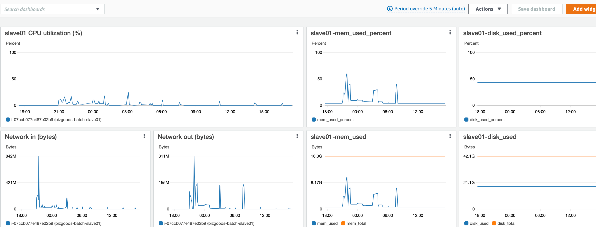
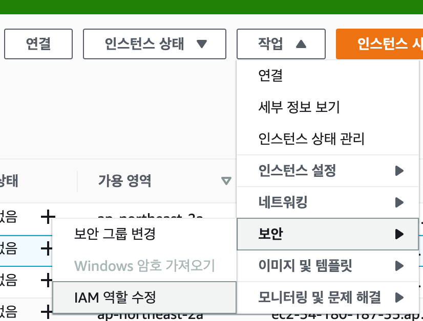

# 🚀 3단계 - 로깅, 모니터링
## 요구사항

- 애플리케이션 진단하기 실습을 진행해보고 문제가 되는 코드를 수정
- 로그 설정하기
- Cloudwatch로 모니터링

## 요구사항 설명
### 로그 설정하기
- Application Log 파일로 저장하기
  - 회원가입, 로그인 등의 이벤트에 로깅을 설정
  - 경로찾기 등의 이벤트 로그를 JSON으로 수집
- Nginx Access Log 설정하기

### Cloudwatch로 모니터링
- Cloudwatch로 로그 수집하기
- Cloudwatch로 메트릭 수집하기
- USE 방법론을 활용하기 용이하도록 대시보드 구성

## 힌트
### A. 로깅
**주의점**

- Avoid side effects
  - logging으로 인해 애플리케이션 기능의 동작에 영향을 미치지 않아야 합니다.
  - 예를 들어 logging하는 시점에 NullPointerException이 발생해 프로그램이 정상적으로 동작하지 않는 상황이 발생하면 안됩니다.
- Be concise and descriptive
  - 각 Logging에는 데이터와 설명이 모두 포함되어야 합니다.
- Log method arguments and return values
  - 메소드의 input과 output을 로그로 남기면 debugger를 사용해 디버깅하지 않아도 됩니다. 특히 debugger를 사용할 수 없는 상황에서는 상당히 유용하게 사용할 수 있습니다.
  - 이를 구현하려면 메소드 앞 부분과 뒷 부분에 지저분한 중복 코드가 계속해서 발생하는 상황이 발생하는데 이는 AOP를 통해 해결할 수 있습니다.
- Delete personal information
  - 로그에 사용자의 전화번호, 계좌번호, 패스워드, 주소, 전화번호와 같은 개인정보를 남기지 않습니다.

**logging level**

Logging Level을 적절하게 나눠 구현하는 것이 신경쓰면서 개발해야 합니다.
`ERROR` : 예상하지 못한 심각한 문제가 발생하여 즉시 조사해야 함
`WARN` : 로직상 유효성 확인, 예상 가능한 문제로 인한 예외처리 등을 남김, 서비스는 운영될 수 있지만, 주의해야 함
`INFO` : 운영에 참고할만한 사항으로, 중요한 비즈니스 프로세스가 완료됨
`DEBUG` / `TRACE` : 개발 단계에서만 사용하고 운영 단계에서는 사용하지 않음
- 즉, DEBUG 레벨로 설정하면 DEBUG 레벨보다 높은 로그 레벨의 메시지가 모두(DEBUG, INFO, WARN, ERROR) 출력됩니다. ERROR 레벨로 설정하면 ERROR 레벨의 로그만 출력되는 방식으로 동작합니다.

### B. Application Log
애플리케이션의 상태를 확인하기 위해서는 로그를 남기는 것이 중요합니다. 무엇을 로그로 남겨야 할지, 로그를 어떻게 관리해야 할지 고민해보며 학습해보세요.
- [스프링 Docs](https://docs.spring.io/spring-boot/docs/2.2.7.RELEASE/reference/html/spring-boot-features.html#boot-features-logging)
- [logback 공식 사이트](https://logback.qos.ch/documentation.html)
- [함께보면 좋을 자료](https://meetup.toast.com/posts/149)

**예제 코드를 참고하여 미션을 진행합니다. ([링크](https://github.com/woowacourse/java-deploy/tree/feat/logging))**

**a. logback.xml을 작성합니다.**
- logback의 기본 설정 파일은 logback.xml 입니다. logback 라이브러리는 classpath 아래에 위치하는 logback.xml을 기본으로 찾아봅니다.
```xml
<configuration debug="false">

    <!--spring boot의 기본 logback base.xml은 그대로 가져간다.-->
    <include resource="org/springframework/boot/logging/logback/base.xml" />
    <include resource="file-appender.xml" />

    <!--    logger name이 file일때 적용할 appender를 등록한다.-->
    <logger name="file" level="INFO" >
        <appender-ref ref="file" />
    </logger>
</configuration>
```
```xml
    <property name="home" value="log/" />

    <!--  appender이름이 file인 consoleAppender를 선언  -->
    <appender name="file" class="ch.qos.logback.core.rolling.RollingFileAppender">
        <!--로깅이 기록될 위치-->
        <file>${home}file.log</file>
        <!--로깅 파일이 특정 조건을 넘어가면 다른 파일로 만들어 준다.-->
        <rollingPolicy class="ch.qos.logback.core.rolling.TimeBasedRollingPolicy">
            <fileNamePattern>${home}file-%d{yyyyMMdd}-%i.log</fileNamePattern>
            <timeBasedFileNamingAndTriggeringPolicy class="ch.qos.logback.core.rolling.SizeAndTimeBasedFNATP">
                <maxFileSize>15MB</maxFileSize>
            </timeBasedFileNamingAndTriggeringPolicy>
        </rollingPolicy>
        <!--   해당 로깅의 패턴을 설정   -->
        <encoder>
            <charset>utf8</charset>
            <Pattern>
                %d{yyyy-MM-dd HH:mm:ss.SSS} %thread %-5level %logger - %m%n
            </Pattern>
        </encoder>
    </appender>
```
- logger: 실제 로그 기능을 수행하는 객체로 각 Logger마다 Name을 부여하여 사용합니다.

**b. logback을 이용하여 logging을 찍어봅니다.**

```java
    private static final Logger log = LoggerFactory.getLogger(Controller.class); 
    private static final Logger fileLogger = LoggerFactory.getLogger("file");
    
    ...
    log.error("An ERROR Message");
    fileLogger.info("파일 로깅 입니다.");
```

**c. JSON 로그를 사용한 이벤트 로그 수집**

src/main/resources/logback.xml
```xml
<encoder class="net.logstash.logback.encoder.LogstashEncoder" >
    <includeContext>true</includeContext>
    <includeCallerData>true</includeCallerData>
    <timestampPattern>yyyy-MM-dd HH:mm:ss.SSS</timestampPattern>
    <fieldNames>
        <timestamp>timestamp</timestamp>
        <thread>thread</thread>
        <message>message</message>
        <stackTrace>exception</stackTrace>
        <mdc>context</mdc>
    </fieldNames>
</encoder>
```
```groovy
dependencies {
    implementation("net.logstash.logback:logstash-logback-encoder:6.1")
}
```
```java
// static import net.logstash.logback.argument.StructuredArguments.kv
        log.info("{}, {}",
            kv("출발지", source.getName()),
            kv("도착지", target.getName())
        );
);
```

###C. Nginx Log
- volume 옵션을 활용하여 호스트의 경로와 도커의 경로를 마운트합니다.
```shell
$ docker run -d -p 80:80 -v /var/log/nginx:/var/log/nginx nextstep/reverse-proxy
```

###D. 도커 상태 확인하기(cAdvisor 설치하기)
````shell
docker run \
  --volume=/:/rootfs:ro \
  --volume=/var/run:/var/run:ro \
  --volume=/sys:/sys:ro \
  --volume=/var/lib/docker/:/var/lib/docker:ro \
  --volume=/dev/disk/:/dev/disk:ro \
  --publish=8080:8080 \
  --detach=true \
  --name=cadvisor \
  google/cadvisor:latest
````
Docker로 운영하는 경우 cAdvisor를 활용하여 간단한 모니터링이 가능합니다.
- 호스트 리소스 모니터링에 필요한 디렉토리를 볼륨으로 지정
  - 보안을 위해 읽기 전용으로 볼륨 지정
- 포트는 8080으로 오픈

###E. Cloudwatch로 수집하기
**a. EC2에 IAM role 설정**



**b. cloudwatch logs agent를 설치합니다.**
````shell
$ curl https://s3.amazonaws.com/aws-cloudwatch/downloads/latest/awslogs-agent-setup.py -O

$ sudo python ./awslogs-agent-setup.py --region  ap-northeast-2
````

- **Access Key, Secret Key 등을 입력하지 마세요! IAM Role 설정으로 충분합니다.**

**c. 로그 수집**
````shell
$ sudo vi /var/awslogs/etc/awslogs.conf

[/var/log/syslog]
datetime_format = %b %d %H:%M:%S
file = /var/log/syslog
buffer_duration = 5000
log_stream_name = {instance_id}
initial_position = start_of_file
log_group_name = [로그그룹 이름]

[/var/log/nginx/access.log]
datetime_format = %d/%b/%Y:%H:%M:%S %z
file = /var/log/nginx/access.log
buffer_duration = 5000
log_stream_name = access.log
initial_position = end_of_file
log_group_name = [로그그룹 이름]

[/var/log/nginx/error.log]
datetime_format = %Y/%m/%d %H:%M:%S
file = /var/log/nginx/error.log
buffer_duration = 5000
log_stream_name = error.log
initial_position = end_of_file
log_group_name = [로그그룹 이름]
````
````shell
$ sudo service awslogs restart
````
- **로그그룹 이름은 자신의 github id 로 지정합니다.**

**d. Metric 수집**
- EC2 Metric 수집
````shell
$ wget https://s3.amazonaws.com/amazoncloudwatch-agent/ubuntu/amd64/latest/amazon-cloudwatch-agent.deb
$ sudo dpkg -i -E ./amazon-cloudwatch-agent.deb
````
```shell
# /opt/aws/amazon-cloudwatch-agent/bin/config.json
{
        "agent": {
                "metrics_collection_interval": 60,
                "run_as_user": "root"
        },
        "metrics": {
                "metrics_collected": {
                        "disk": {
                                "measurement": [
                                        "used_percent",
                                        "used",
                                        "total"
                                ],
                                "metrics_collection_interval": 60,
                                "resources": [
                                        "*"
                                ]
                        },
                        "mem": {
                                "measurement": [
                                        "mem_used_percent",
                                        "mem_total",
                                        "mem_used"
                                ],
                                "metrics_collection_interval": 60
                        }
                }
        }
}
```
```shell
$ sudo /opt/aws/amazon-cloudwatch-agent/bin/amazon-cloudwatch-agent-ctl -a fetch-config -m ec2 -s -c file:/opt/aws/amazon-cloudwatch-agent/bin/config.json
$ sudo /opt/aws/amazon-cloudwatch-agent/bin/amazon-cloudwatch-agent-ctl -m ec2 -a status
{
  "status": "running",
  "starttime": "2021-03-20T15:12:07+00:00",
  "configstatus": "configured",
  "cwoc_status": "stopped",
  "cwoc_starttime": "",
  "cwoc_configstatus": "not configured",
  "version": "1.247347.5b250583"
}
```
- 위젯 추가 > 유형으로 행 선택 > 원본데이터로 지표 선택 > CPU Utilization, Network In / Out, mem_used_percent, disk_used_percent 등을 추가


- Spring Actuator Metric 수집
```shell
dependencies {
    implementation("org.springframework.boot:spring-boot-starter-actuator")
    implementation("org.springframework.cloud:spring-cloud-starter-aws:2.2.1.RELEASE")
    implementation("io.micrometer:micrometer-registry-cloudwatch")
}    
```
```shell
cloud.aws.stack.auto=false  # 로컬에서 실행시 AWS stack autoconfiguration 수행과정에서 발생하는 에러 방지
cloud.aws.region.static=ap-northeast-2
management.metrics.export.cloudwatch.namespace=  # 해당 namespace로 Cloudwatch 메트릭을 조회 가능
management.metrics.export.cloudwatch.batch-size=20
management.endpoints.web.exposure.include=*
```

### 📚 Todo List 📚
- [x] 애플리케이션 진단하기 실습을 진행해보고 문제가 되는 코드를 수정
```shell
# thread/thread.dump 106번째줄
	at com.mysql.cj.protocol.ReadAheadInputStream.read(ReadAheadInputStream.java:180)
	- locked <0x000000079f347348> (a com.mysql.cj.protocol.ReadAheadInputStream)
	...
	at com.mysql.cj.jdbc.ClientPreparedStatement.executeInternal(ClientPreparedStatement.java:930)
	- locked <0x000000079f342fe8> (a com.mysql.cj.jdbc.ConnectionImpl)
	at com.mysql.cj.jdbc.ClientPreparedStatement.executeQuery(ClientPreparedStatement.java:1003)
	- locked <0x000000079f342fe8> (a com.mysql.cj.jdbc.ConnectionImpl)
	...
	at com.sun.proxy.$Proxy108.findAll(Unknown Source)
	at nextstep.subway.line.application.LineService.findLineResponses(LineService.java:35)
	at nextstep.subway.line.application.LineService$$FastClassBySpringCGLIB$$c48cb19.invoke(<generated>)
```
- [x] 로그 설정하기
  - [x] Application Log 파일로 저장하기
    - 회원가입, 로그인 등의 이벤트에 로깅을 설정
    - 경로찾기 등의 이벤트 로그를 JSON으로 수집
  - [x] Nginx Access Log 설정하기
- [x] Cloudwatch로 모니터링
  - [x] Cloudwatch로 로그 수집하기
  - [x] Cloudwatch로 메트릭 수집하기
  - [x] USE 방법론을 활용하기 용이하도록 대시보드 구성

- log path
```shell
# Application log Path
/home/nextstep/infra-subway-monitoring/log/application_json.log
/home/nextstep/infra-subway-monitoring/log/application_file.log

# nginx log path
/home/nginx/log/access.log
/home/nginx/log/error.log
```

- cloudwatch url
https://ap-northeast-2.console.aws.amazon.com/cloudwatch/home?region=ap-northeast-2#dashboards:name=mond-page-dashboard
